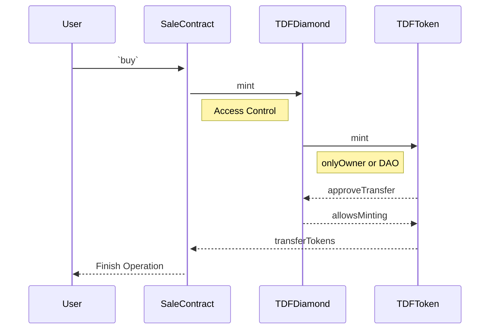

# Proof of Presence

This is a collection of contracts aiming to implement tokenized timeshare access to land projects.
You can read more about Closer in our [Documentation](https://closer.gitbook.io/closer-protocol/)

This contracts include:

- ERC20 token
- Booking System:

      Implemented a locking mechanism to reuse the tokens every year preventing doble spending by locking those tokens in a Diamond contract

- Sale Contract:
  minting operation from sale contract:



For introspection of the diamond you can use [Louper](https://louper.dev/).

## BUG BOUNTY

If you find critical security gaps in our smart contract code, please reach sam@closer.earth.
For smaller issues you can create tickets in our open source code repositories and we will happily consider an appropriate reward.

## INSTALL

```bash
yarn
```

## SETUP

### ENV variables

1. duplicate .env.example
2. fill the required env variables. Most importantly `PRIVATE_KEY`

### Get access roles

You should had been given `DEFAULT_ADMIN_ROLE` in the Diamond to be able to execute any of this functions

**grant minting role:** _recommended only for alfajores network_

```bash
npx hardhat diamond:grant-role [ADDRESS] --minter --network alfajores
```

You can give different roles by changing the `--minter` flag

### Minting for development

Once your `.env` `PRIVATE_KEY` has `minter` role you can just mint like this:

```bash
npx hardhat diamond:mint --address [ADDRESS] --amount [amount] --network alfajores

# ex:
#
#     npx hardhat diamond:mint --address 0x661Ac71bbe43fe56935c1CA4d62e62ed380950A3 --amount 32 --network alfajores
```

## TEST

- One using hardhat that can leverage hardhat-deploy to reuse deployment procedures and named accounts:

```bash
yarn test
```

## Hardhat tasks

### deploy

```
npx hardhat deploy --network alfajores
```

### Grant role

```
npx hardhat diamond:grant-role 0xbE5B7A0F27e7Ec296670c3fc7c34BE652303e716 --network alfajores
```

## SCRIPTS

Here is the list of npm scripts you can execute:

Some of them relies on [./\_scripts.js](./_scripts.js) to allow parameterizing it via command line argument (have a look inside if you need modifications)
<br/><br/>

### `yarn prepare`

As a standard lifecycle npm script, it is executed automatically upon install. It generate config file and typechain to get you started with type safe contract interactions
<br/><br/>

### `yarn lint`, `yarn lint:fix`, `yarn format` and `yarn format:fix`

These will lint and format check your code. the `:fix` version will modifiy the files to match the requirement specified in `.eslintrc` and `.prettierrc.`
<br/><br/>

### `yarn compile`

These will compile your contracts
<br/><br/>

### `yarn void:deploy`

This will deploy your contracts on the in-memory hardhat network and exit, leaving no trace. quick way to ensure deployments work as intended without consequences
<br/><br/>

### `yarn test [mocha args...]`

These will execute your tests using mocha. you can pass extra arguments to mocha
<br/><br/>

## Verify contracts

```
hh --network alfajores sourcify
```

### `yarn coverage`

These will produce a coverage report in the `coverage/` folder
<br/><br/>

### `yarn gas`

These will produce a gas report for function used in the tests
<br/><br/>

### `yarn dev`

These will run a local hardhat network on `localhost:8545` and deploy your contracts on it. Plus it will watch for any changes and redeploy them.
<br/><br/>

### `yarn local:dev`

This assumes a local node it running on `localhost:8545`. It will deploy your contracts on it. Plus it will watch for any changes and redeploy them.
<br/><br/>

### `yarn execute <network> <file.ts> [args...]`

This will execute the script `<file.ts>` against the specified network
<br/><br/>

### `yarn deploy <network> [args...]`

This will deploy the contract on the specified network.

Behind the scene it uses `hardhat deploy` command so you can append any argument for it
<br/><br/>

### `yarn export <network> <file.json>`

This will export the abi+address of deployed contract to `<file.json>`
<br/><br/>

### `yarn fork:execute <network> [--blockNumber <blockNumber>] [--deploy] <file.ts> [args...]`

This will execute the script `<file.ts>` against a temporary fork of the specified network

if `--deploy` is used, deploy scripts will be executed
<br/><br/>

### `yarn fork:deploy <network> [--blockNumber <blockNumber>] [args...]`

This will deploy the contract against a temporary fork of the specified network.

Behind the scene it uses `hardhat deploy` command so you can append any argument for it
<br/><br/>

### `yarn fork:test <network> [--blockNumber <blockNumber>] [mocha args...]`

This will test the contract against a temporary fork of the specified network.
<br/><br/>

### `yarn fork:dev <network> [--blockNumber <blockNumber>] [args...]`

This will deploy the contract against a fork of the specified network and it will keep running as a node.

Behind the scene it uses `hardhat node` command so you can append any argument for it

## LICENCE

This software is released under [MIT licence](https://github.com/closerdao/proof-of-presence/blob/main/LICENSE)
