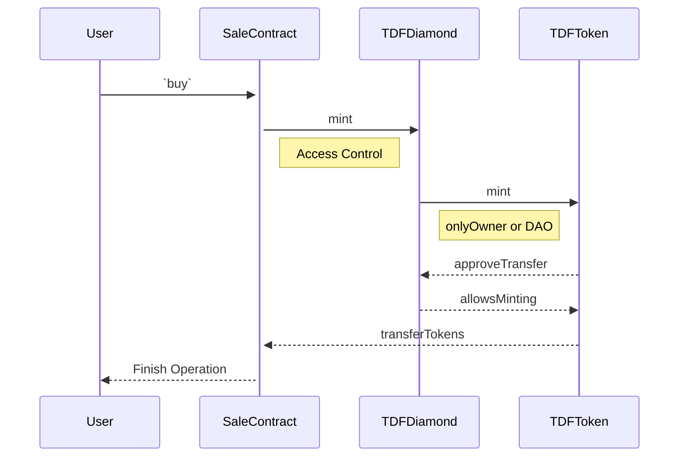

# Proof of Presence

## DEPLOYED CONTRACTS

Legacy TDF v1 deployed contract addresses, implementations, proxies, and facets are tracked under the
`deployments/<network>/` directories. New one-click village deployments write versioned manifests under
`deployments/villages/<chainId>/<villageSlug>.json` or `deployments/profiles/tdf-v2/<chainId>/<villageSlug>.json`.

The authoritative cross-repository checklist for unfinished V2 contracts, deployment, API, UI, security, and rollout
work is [`docs/V2_REMAINING_WORK.md`](./docs/V2_REMAINING_WORK.md).

For previewing and interacting with the TDFDiamond, it's best to use [louper.dev](https://louper.dev).

### Celo Mainnet

| Contract      | Address                                                                                                                |
| ------------- | ---------------------------------------------------------------------------------------------------------------------- |
| TDFDiamond    | [`0x475398EeE0E22cb6fe5403ffA294Fb10Ad989e17`](https://celoscan.io/address/0x475398EeE0E22cb6fe5403ffA294Fb10Ad989e17) |
| TDFToken      | [`0x10CB7F49389787A99b59B2f87dfDd3bba141559f`](https://celoscan.io/address/0x10CB7F49389787A99b59B2f87dfDd3bba141559f) |
| PresenceToken | [`0x5Bc8e45E6c0019F12bE2979De614AF3cc63538e9`](https://celoscan.io/address/0x5Bc8e45E6c0019F12bE2979De614AF3cc63538e9) |
| SweatToken    | [`0xa2898Dd4628eD626bf841530f87c9F1ebA837c87`](https://celoscan.io/address/0xa2898Dd4628eD626bf841530f87c9F1ebA837c87) |
| DynamicSale   | [`0xEaa00a0e0D29D1F883485E8f98A0E8FfD75B23FB`](https://celoscan.io/address/0xEaa00a0e0D29D1F883485E8f98A0E8FfD75B23FB) |

### Celo Sepolia Testnet

| Contract      | Address                                                                                                                        |
| ------------- | ------------------------------------------------------------------------------------------------------------------------------ |
| TDFDiamond    | [`0x5D2870B37aB72AB9Cc3F46878373EeCc1312FA6e`](https://sepolia.celoscan.io/address/0x5D2870B37aB72AB9Cc3F46878373EeCc1312FA6e) |
| TDFToken      | [`0x5Bc8e45E6c0019F12bE2979De614AF3cc63538e9`](https://sepolia.celoscan.io/address/0x5Bc8e45E6c0019F12bE2979De614AF3cc63538e9) |
| PresenceToken | [`0xBA72D0644F465D78e5076284ea3480f4dBc006F6`](https://sepolia.celoscan.io/address/0xBA72D0644F465D78e5076284ea3480f4dBc006F6) |
| SweatToken    | [`0x913d4e87A54A89DaCB80279d263aFd6a500889b5`](https://sepolia.celoscan.io/address/0x913d4e87A54A89DaCB80279d263aFd6a500889b5) |
| DynamicSale   | [`0x076F0Ba89A33A6b268F164ddb2cC61df75Ee0168`](https://sepolia.celoscan.io/address/0x076F0Ba89A33A6b268F164ddb2cC61df75Ee0168) |
| Crowdsale     | [`0xdD5FCC4992C5C8795c557B2865B2ceE6c2CF6316`](https://sepolia.celoscan.io/address/0xdD5FCC4992C5C8795c557B2865B2ceE6c2CF6316) |

For generic village and TDF v2 profile deployments, use the per-village manifest as the source of truth and generate
consumer exports from it with `yarn export:village`.

## Repo description

This is a collection of contracts aiming to implement tokenized timeshare access to land projects.
You can read more about Closer in our [Documentation](https://closer.gitbook.io/closer-protocol/)

This contracts include:

- ERC20 token
- Booking System:

      Implemented a locking mechanism to reuse the tokens every year preventing doble spending by locking those tokens in a Diamond contract

- Sale Contract:
  minting operation from sale contract:


```mermaid
sequenceDiagram
    participant User
    participant SaleContract
    participant TDFDiamond
    participant TDFToken
    User->>+SaleContract: `buy`
    SaleContract->>TDFDiamond: mint
    Note left of TDFDiamond: Access Control
    TDFDiamond->>TDFToken: mint
    Note left of TDFToken: onlyOwner or DAO
    TDFToken-->>TDFDiamond: approveTransfer
    TDFDiamond-->>TDFToken: allowsMinting
    TDFToken-->>SaleContract: transferTokens
    SaleContract-->>User: Finish Operation
```

## BUG BOUNTY

If you find critical security gaps in our smart contract code, please reach sam@closer.earth.
For smaller issues you can create tickets in our open source code repositories and we will happily consider an appropriate reward.

## INSTALL

```bash
yarn
```

## SETUP

### ENV variables

1. duplicate .env.example
2. fill the required env variables. Most importantly `PRIVATE_KEY`

### Get access roles

You should had been given `DEFAULT_ADMIN_ROLE` in the Diamond to be able to execute any of this functions

**grant minting role:** _recommended only for celoSepolia network_

```bash
npx hardhat diamond:grant-role [ADDRESS] --minter --network celoSepolia
```

You can give different roles by changing the `--minter` flag

### Minting for development

Once your `.env` `PRIVATE_KEY` has `minter` role you can just mint like this:

```bash
npx hardhat diamond:mint --address [ADDRESS] --amount [amount] --network celoSepolia

# ex:
#
#     npx hardhat diamond:mint --address 0x661Ac71bbe43fe56935c1CA4d62e62ed380950A3 --amount 32 --network celoSepolia
```

## TEST

- One using hardhat that can leverage hardhat-deploy to reuse deployment procedures and named accounts:

```bash
yarn test
```

## Hardhat tasks

### deploy

```
yarn deploy
```

Bare deploy is intentionally non-transactional and prints the explicit deployment commands.

### Grant role

```
npx hardhat diamond:grant-role 0xbE5B7A0F27e7Ec296670c3fc7c34BE652303e716 --network celoSepolia
```

## SCRIPTS

Here is the list of npm scripts you can execute:

Some of them relies on [./\_scripts.js](./_scripts.js) to allow parameterizing it via command line argument (have a look inside if you need modifications)
<br/><br/>

### `yarn prepare`

As a standard lifecycle npm script, it is executed automatically upon install. It generate config file and typechain to get you started with type safe contract interactions
<br/><br/>

### `yarn lint`, `yarn lint:fix`, `yarn format` and `yarn format:fix`

These will lint and format check your code. the `:fix` version will modifiy the files to match the requirement specified in `.eslintrc` and `.prettierrc.`
<br/><br/>

### `yarn compile`

These will compile your contracts
<br/><br/>

### `yarn deploy`

Prints the explicit deployment commands. It does not submit transactions.
<br/><br/>

### `yarn test [mocha args...]`

These will execute your tests using mocha. you can pass extra arguments to mocha
<br/><br/>

## Verify contracts on Sourcify

```
npx hardhat --network celoSepolia sourcify
```

### `yarn coverage`

These will produce a coverage report in the `coverage/` folder
<br/><br/>

### `yarn gas`

These will produce a gas report for function used in the tests
<br/><br/>

### `yarn dev:node`

This will run a local Hardhat network on `localhost:8545`.
<br/><br/>

### `yarn execute <network> <file.ts> [args...]`

This will execute the script `<file.ts>` against the specified network
<br/><br/>

### `yarn deploy:village -- --config <file.json> [--network <network>]`

Deploys a generic village from a strict schema-v2 config. `ownership.mode` is either `direct` (the default) or
`deployer-handoff`; `ownership.finalOwner` is an existing Safe or EOA. The script validates chain ID, owner, modules,
roles, and UUPS safety before deploying through Hardhat Ignition, the authoritative V2 resumption journal.
<br/><br/>

### `yarn deploy:contract -- --contract <name> --config <file.json> [--network <network>]`

Deploys one allowlisted V2 contract Module plus its required dependency Modules through the same validation,
Ignition, reconciliation, verification, and manifest path used by village profiles. Supported names are
`VillageAccess`, `CommunityToken`, `VillagePresenceToken`, `VillageSweatToken`, `TokenizedStays`, and
`TDFTransferPolicy`.
<br/><br/>

### `yarn deploy:tdf-v2 -- --config <file.json> [--network <network>]`

Deploys the TDF v2 profile over generic village modules. The config must use `deploymentProfile: "tdf-v2"` and include
TDF transfer-policy settings.
<br/><br/>

### `yarn deploy:legacy <network> [args...]`

Runs only the legacy TDF v1 Rocketh deployment tags from `deploy/legacy/tdf-v1`.
<br/><br/>

### `yarn verify:village -- --manifest <manifest.json>`

Runs `hardhat ignition verify` for the manifest deployment ID and records a concise attempt in the manifest.
<br/><br/>

### `yarn upgrade:v2:prepare -- --manifest <file> --contract <name> --implementation <artifact> --version <id>`

Runs OpenZeppelin `validateUpgrade` before any transaction, deploys only the proposed implementation through a stable
Ignition upgrade Module, and appends a prepared `upgradeToAndCall` owner action plus immutable history to the manifest.
It never executes the upgrade. Optional migration data is supplied with `--call` and JSON `--call-args`. Submit or
inspect the resulting owner transaction with `owner:submit`/`owner:status` and `--upgrade <contract>:<version>`.
<br/><br/>

### `yarn owner:submit -- --manifest <manifest.json> --network <network>`

Submits pending direct-owner configuration or a prepared upgrade. An EOA action is sent by the matching Hardhat
signer. A Safe action is constructed with Protocol Kit and proposed with API Kit using
`SAFE_PROPOSER_PRIVATE_KEY`; proposal does not execute the Safe transaction. `safe:propose` remains an alias.
<br/><br/>

### `yarn owner:status -- --manifest <manifest.json> --network <network>`

Reconciles owner actions against on-chain state and, for Safe transactions, records Transaction Service confirmation
and execution state. `safe:status` remains an alias.

With `ownership.mode: "deployer-handoff"`, the deployer completes all configuration before initiating two-step
ownership/default-admin transfers. The deployment is then complete. Recipient acceptance is intentionally manual;
the manifest and deployment output list every target, function, calldata, recipient, and acceptance schedule.
<br/><br/>

### `yarn analyze:slither`

Runs local-only Slither analysis for the V2 contracts while filtering legacy and dependency findings. Install once with
`uv tool install slither-analyzer`. Slither is intentionally not a CI gate until its initial findings and suppressions
have been reviewed.
<br/><br/>

### `yarn export:village -- --manifest <manifest.json> [--out <file.json>]`

Exports ABI/address data from a village manifest. This is a derived consumer artifact; the manifest remains the source
of truth.
<br/><br/>

### `yarn fork:execute <network> [--blockNumber <blockNumber>] [--deploy] <file.ts> [args...]`

This will execute the script `<file.ts>` against a temporary fork of the specified network

if `--deploy` is used, only the legacy TDF v1 deployment namespace is loaded before the script runs
<br/><br/>

### `yarn fork:deploy <network> [--blockNumber <blockNumber>] [args...]`

This legacy helper deploys the legacy TDF v1 tags against a temporary fork of the specified network.
<br/><br/>

### `yarn fork:test <network> [--blockNumber <blockNumber>] [mocha args...]`

This will test the contract against a temporary fork of the specified network.
<br/><br/>

### `yarn fork:dev <network> [--blockNumber <blockNumber>] [args...]`

This starts a fork of the specified network and keeps it running as a node. Use `yarn fork:deploy` when you need to run
the legacy TDF v1 deploy namespace on a fork.

Behind the scene it uses `hardhat node` command so you can append any argument for it

## LICENCE

This software is released under [MIT licence](https://github.com/closerdao/proof-of-presence/blob/main/LICENSE)
